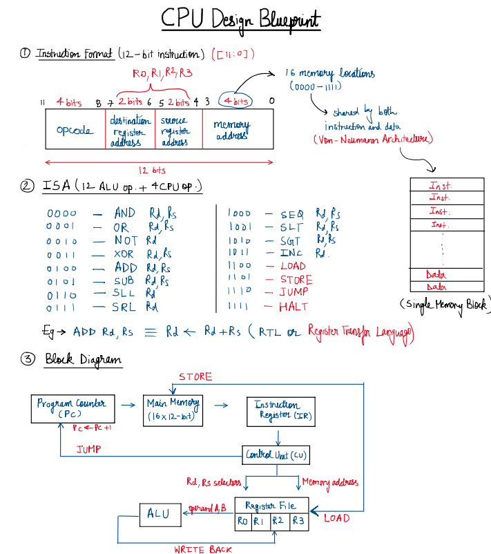
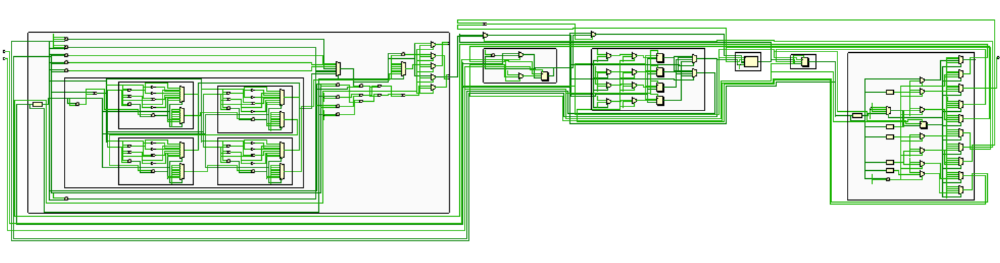
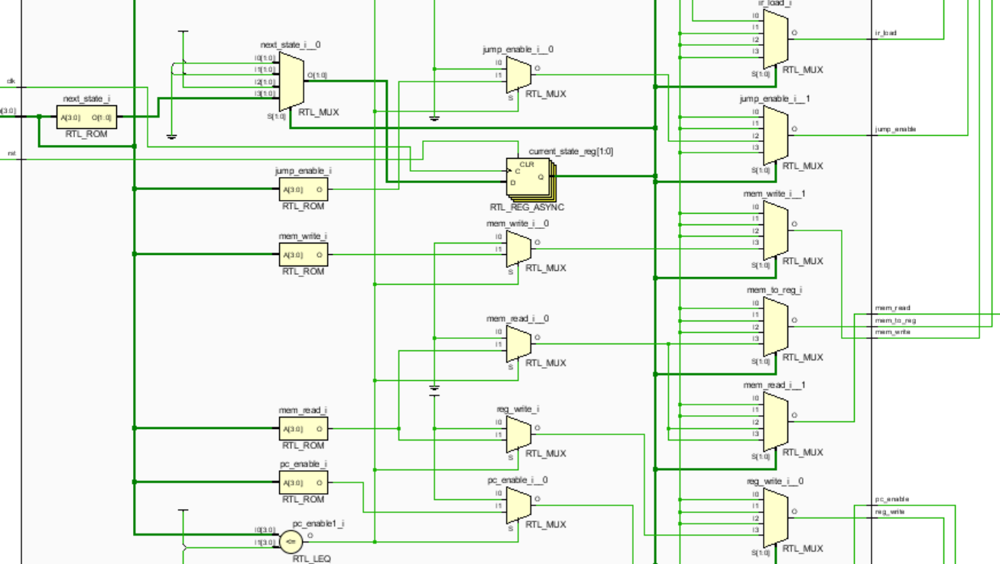
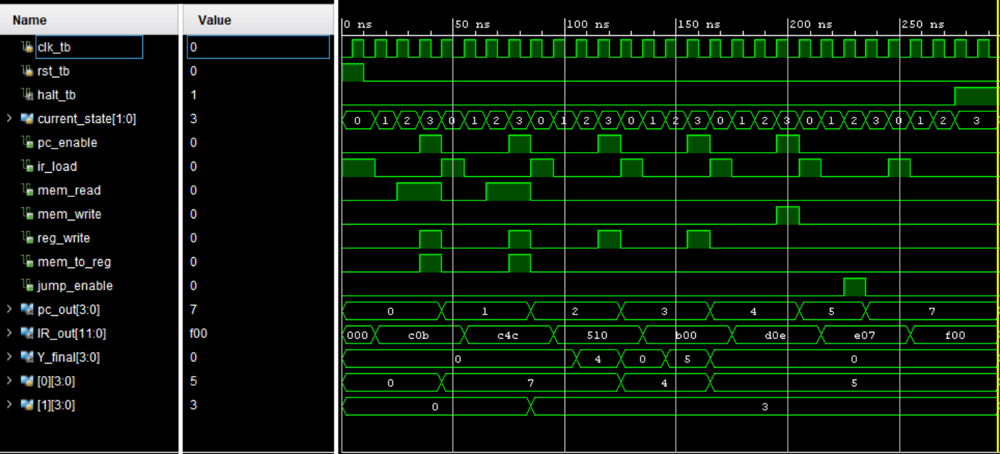
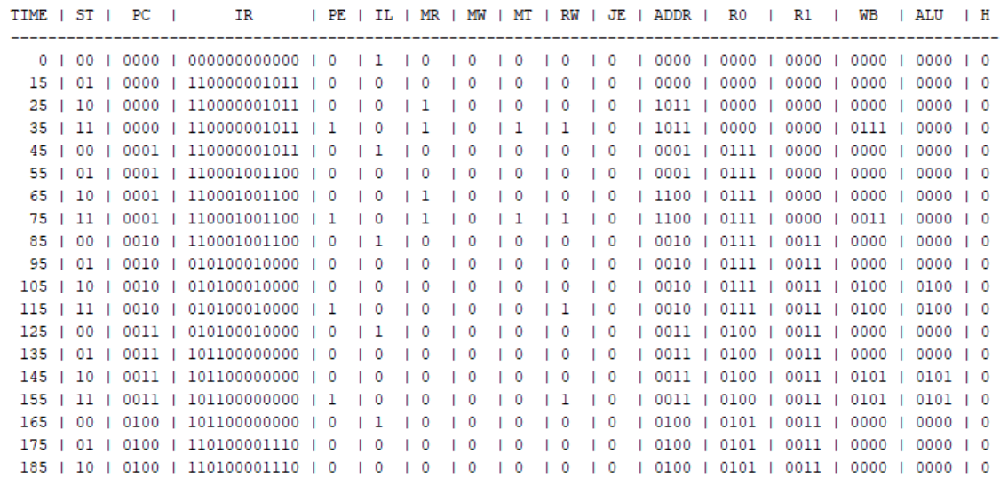
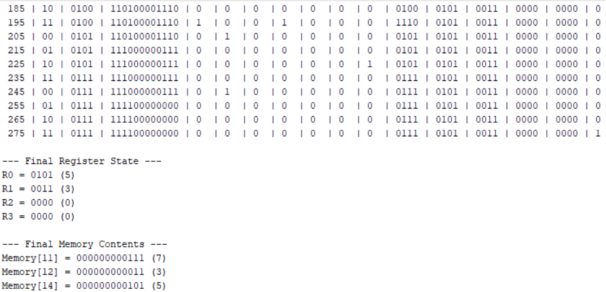

# 4-bit Multi-Cycle CPU

## 1. Project Overview
This project presents the design and implementation of a **4-bit multi-cycle CPU** using Verilog HDL. The CPU is based on the **Von Neumann architecture** and supports a custom **16-instruction ISA**. Each instruction is executed over **multiple clock cycles** through the FETCH, DECODE, EXECUTE, and WRITEBACK stages while supporting arithmetic, logical, memory, and control operations.

## 2. Project Structure

```text
4_bit_Multi_Cycle_CPU/
│
├── src/
│   ├── Program_Counter.v
│   ├── Instruction_Register.v
│   ├── Main_Memory.v
│   ├── Register_File.v
│   ├── Control_Unit.v
│   ├── CPU_ALU.v
│   ├── ALU_4_bit.v
│   ├── ALU_1_bit.v
│   └── CPU_TOP.v
│
├── tb/
│   └── CPU_TOP_tb.v
│
├── individual_tb/
│   ├── Program_Counter_tb.v
│   ├── Instruction_Register_tb.v
│   ├── Register_File_tb.v
│   ├── Control_Unit_tb.v
│   └── CPU_ALU_tb.v
│
├── docs/
│   ├── blueprint.png
│   ├── CPU_full.png
│   ├── cu_zoom.png
│   ├── waveform.png
│   ├── console1.png
│   └── console2.png
│
├── LICENSE
├── README.md
└── Technical_Design.md
```
> [!NOTE]
> 1. `CPU_TOP_tb.v` is the primary testbench used to verify the complete processor. The individual module testbenches are provided separately for independent module verification.
> 2. Main Memory doesn't have its own testbench because it only stores the preloaded program which is self-explanatory.

## 3. CPU Specifications

<div align="center">
 
| Parameter | Specification |
|:----------:|:-----------:|
| Architecture | Von Neumann Architecture |
| Datapath Width | 4 bits |
| Instruction Width | 12 bits |
| Register File | 4 General Purpose Registers (R0-R3)|
| Memory Organisation | Unified Instruction and Data Memory |
| Memory Size | 16 x 12-bit |
| Program Counter Width | 4 bits |

</div>

## 4. Instruction Set Architecture (ISA)
The ISA supports 16 operations out of which, first 12 are ALU operations and last 4 are CPU operations. The instruction descriptions are written using Register Transfer Language (RTL). 

**Rd** - Destination Register <br>
**Rs** - Source Register

<div align="center">
<table>
<tr>
<td valign="top">

| Opcode | Operation | Description |
|:---:|:---:|:---:|
| 0000 | AND | Rd ← Rd AND Rs |
| 0001 | OR | Rd ← Rd OR Rs |
| 0010 | NOT | Rd ← ~Rd |
| 0011 | XOR | Rd ← Rd XOR Rs |
| 0100 | ADD | Rd ← Rd + Rs |
| 0101 | SUB | Rd ← Rd - Rs |
| 0110 | SLL | Rd ← Rd << 1 |
| 0111 | SRL | Rd ← Rd >> 1 |

</td>
<td valign="top">

| Opcode | Operation | Description |
|:---:|:---:|:---:|
| 1000 | SEQ | Rd ← (Rd == Rs) |
| 1001 | SLT | Rd ← (Rd < Rs) |
| 1010 | SGT | Rd ← (Rd > Rs) |
| 1011 | INC | Rd ← Rd + 1 |
| 1100 | LOAD | Rd ← Memory[Address] |
| 1101 | STORE | Memory[Address] ← Rd |
| 1110 | JUMP | PC ← Jump_Address |
| 1111 | HALT | CPU execution stops |

</td>
</tr>
</table>
</div>

## 5. CPU Blueprint

This section presents the design planning done before implementation. The instruction format, ISA organization, control path, datapath, and overall CPU block diagram were defined to establish the operation and data flow of the processor.

<div align="center">
 


</div>

***CPU Working Principle***

The Program Counter provides the memory address during instruction FETCH, which is accessed from the Main Memory and loaded into the Instruction Register. The Control Unit decodes the instruction and generates the required control signals. Depending on the instruction, data moves between the Register File, ALU, and Main Memory, while the WRITEBACK stage writes the selected result back into the Register File.

## 6. Technical Documentation
> [!NOTE]
> The detailed architectural and implementation aspects of the processor, including individual module design, control unit operation, debugging experience, limitations, and future improvements, are documented separately in [Technical_Design.md](Technical_Design.md).

## 7. Sample Program
As the CPU at this stage cannot directly take inputs from the user, a preloaded sample program is stored in the Main Memory to demonstrate the execution of different instructions.

<div align="center">

| Address | Contents       | Meaning               |
| :------: | :--------------: |:---------------------: |
|  0 | LOAD R0,11     | Load first operand into R0   |
|  1 | LOAD R1,12     | Load second operand into R1  |
|  2 | SUB R0,R1      | Subtract R1 from R0 and store the result in R0   |
|  3 | INC R0         | Increment the result stored in R0     |
|  4 | STORE R0,14    | Store the value of R0 into memory location 14   |
|  5 | JUMP 7         | Skip next instruction |
|  6 | ADD R0,R1      | Should not execute    |
|  7 | HALT           | Stop CPU              |
|  11 | 0000_0000_0111 | Data value 7          |
|  12 | 0000_0000_0011 | Data value 3          |
|  14 | 0000_0000_0000 | Result location       |

</div>

## 8. Execution Flow
The execution of the sample program is shown below.

### Step 1: LOAD R0,11

The value stored at memory location 11 is loaded into register R0.

```text
R0 ← Memory[11]

R0 = 0111 (7)
R1 = 0
```
---

### Step 2: LOAD R1,12

The value stored at memory location 12 is loaded into register R1.

```text
R1 ← Memory[12]

R0 = 0111 (7)
R1 = 0011 (3)
```
---

### Step 3: SUB R0,R1

The ALU subtracts the contents of R1 from R0 and stores the result back into R0.

```text
R0 = 0111
R1 = 0011

R0 ← R0 - R1
R0 ← 0111 - 0011

R0 = 0100 (4)
```
---

### Step 4: INC R0

The value stored in R0 is incremented by one.

```text
R0 = 0100
R0 ← R0 + 0001

R0 = 0101 (5)
```
---

### Step 5: STORE R0,14

The result stored in R0 is written into memory location 14.

```text
Memory[14] ← R0

Memory[14] = 0101 (5)
```
---

### Step 6: JUMP 7

The Program Counter is updated to address 7, causing the next instruction to be skipped.

```text
PC = 5
PC = 7
```
---

### Step 7: HALT

The HALT instruction stops further execution of the processor.

```text
HALT = 1

CPU execution terminated.
```
---

### Final Result

```text
Memory[14] = 0000_0000_0101 (5)
```

## 9. Simulation Results & Verification
### 9.1 RTL Schematic


**Zoomed Control Unit Section**



### 9.2 Waveform Analysis


### 9.3 Console Output
<p align="center">
  
  
</p>

## 10. How to Run/Simulation Guide
### Prerequisites
- Xilinx Vivado (2017.4 or later), or
- Any Verilog-compatible online simulator.

### Steps
1. Clone the repository.
2. Open Vivado or any other EDA tool and create a new project.
3. Add all the files under `src` folder as design sources.
4. Add all the files under `tb` folder as simulation sources.
5. Set `CPU_TOP` & `CPU_TOP_tb` as top module respectively for design and simulation sources.
6. Under `RTL Analysis`, click on `Open Elaborated Design` → `Schematic` to view the RTL schematic.
7. Under `Simulation`, select `Run Behavioral Simulation` to observe the waveform.
8. Check console output for step-by-step execution trace.
> [!NOTE]
> All testbenches generate VCD waveform files using `$dumpfile` and `$dumpvars`, allowing the design to be simulated on online EDA platforms and viewed using external waveform viewers.

## 11. Key Learnings
- Developed a practical understanding of Computer Architecture, particularly the datapath and control path of CPU.
- Used a multi-cycle FSM design to clearly observe the working of each state and its corresponding control signals.
- Understood the working of shared instruction and data memory in the Von Neumann Architecture.
- Gained experience in integrating previously developed hardware modules, such as the 4-bit ALU, into a larger processor system.
- Developed practical debugging skills while resolving datapath and control logic issues during system integration.


